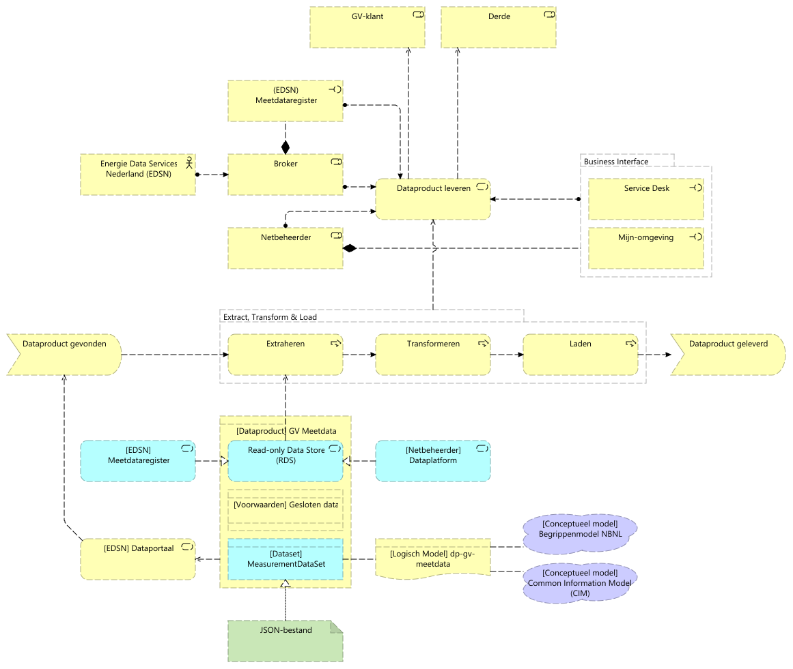

# Inleiding

Dit ontwerp beschrijft de beoogde gebruiksscenario's voor het dataproduct *GV
Meetdata*, alsmede de achterliggende architectuur en gemaakte keuzes.

# Reikwijdte

Er is steeds meer behoefte aan inzicht in data over energieverbruik en
energieopwekking van grootverbruikers (GV) om optimaal gebruik te maken van de
beschikbare energiecapaciteit. Deze data is bijvoorbeeld relevant voor
bedrijven die als energy-hub willen samenwerken op een industrieterrein of voor
organisaties die individuele bedrijven willen helpen met duurzame energie
oplossingen en energiebesparingen. De GV is eigenaar van deze data en moet
toestemming geven aan andere partijen om de data te gebruiken. Een erkend
meetverantwoordelijke (MV) verzorgt de metingen van deze data.

Dit ontwerp beschrijft het proces om tot ontsluiting van het bijbehorende
dataproduct te komen en de betekenis & structuur van het dataproduct.

# Achtergrond

Onderstaand wordt kort de achtergrond toegelicht m.b.t. dataproducten.

## Dataproduct

Voor alle data-uitwisseling binnen de scope van de visie is expliciet gekozen
voor het denken over data in de vorm van dataproducten. Een dataproduct
combineert de semantische-, technische- en gebruiksaspecten van
data-uitwisseling. Om dit invulling te geven bestaat een dataproduct uit de
volgende componenten:

* *dataset*: de daadwerkelijke gegevens die worden uitgewisseld. Zie een
  dataset als een tabel met gegevens, waarbij de kolommen beschrijven wat er op
  elke rij van de data aan gegevens wordt geleverd. Een dataset voor
  aansluitingen zal minstens een kolom "Aansluitingsnummer" bevatten, waarbij
  elke rij in de dataset een aansluiting beschrijft;
* *dataservice*: de technische manier van verspreiden van de dataset. Dit gaat
  over hoe de data ontsloten wordt (als bestand, API, database of *file
  server*);
* *voorwaarden*: er kunnen voorwaarden liggen op beschikbaarheid, kwaliteit,
  classificatie en doelbinding bij gebruik van het dataproduct.

Het dataproduct combineert de *dataset* en *dataservice*, verrijkt met
*voorwaarden* voor gebruik.

## Volume, variety, veracity, velocity

Data kent vier kenmerken:

* *volume*: data kent een volume, een hoeveelheid;
* *variety* (variëteit): data is te verdelen in gestructureerde en
  ongestructureerde data. Ongestructureerde data kent geen metamodel;
* *veracity* (betrouwbaarheid): de mate waarin de data vertrouwd kan worden
  voor de toepassing;
* *velocity* (snelheid): de frequentie waarmee data verandert.

# Dataservice

## Gebruiksscenarios

In dit scenario vraagt de GV-klant of een *derde* (zoals een adviesbureau of
ontwikkelbedrijf) meetgegevens op bij de netbeheerder van een GV-klant. Hierbij
vervult de GV-klant de rol van *Aangeslotene*. Meetdata wordt verstrekt onder
de [Grondslag
toestemming](https://www.autoriteitpersoonsgegevens.nl/themas/basis-avg/avg-algemeen/grondslag-toestemming).

> [!IMPORTANT]
> Het gebruiksscenario gaat uit van *geauthenticeerde rollen*. Voor
> authenticatie dient aangesloten te worden op bestaande processen. Indien er
> geen *enrolment- en authenticatieproces* is *moet* deze worden ingericht.

> [!IMPORTANT] Niet alle netbeheerders kennen een faciliteit om derden te
> authenticeren.

1. een GV-klant of een derde (e.g. een ontwikkelbedrijf) vraagt
   meetgegevens voor één of meerdere aansluitingen bij de corresponderende
   netbeheerder. GV-klanten vragen meetdata aan voor eigen aansluitingen,
   derden voor te specificeren aansluitingen;
2. de netbeheerder toetst of er toestemming is verleend voor de combinatie
   derde/aansluiting. In de GV-klant meetdata voor eigen aansluitingen
   aanvraagt is toestemming niet vereist;
3. indien er geen toestemming is voor opvragen van de meetdata wordt de
   aangeslotene gevraagd deze te verlenen;
4. de verleende toestemming wordt vastgelegd in het Toestemmingplatform;
5. het Toestemmingplatform notificeert netbeheerder dat toestemming verleend
   is door de aangeslotene;
6. de netbeheerder vraagt op basis van de EANs behorende bij de GV-klant de
   meetgegevens op bij EDSN, vanuit het C-ARM. Indien de aanvraag door een
   derde is gedaan wordt de meetdata op basis van de in de toestemming
   vastgelegde aansluitingen geleverd;
7. EDSN levert de meetgegevens vanuit het C-ARM;
8. de netbeheerder verwerkt de meetgegevens, waarbij de meetgegevens in een
   voor de GV-klant bruikbaar formaat worden omgezet;
9. de meetgegevens worden aan de GV-klant geleverd.

Het beschreven scenario kent een aantal varianten voor implementatie:

* de netbeheerder kan ervoor kiezen handmatig de verzoeken voor meetdata af te
  handelen. Hierbij zal de *service desk* van de netbeheerder (of *Partners in
  Energie* voor Liander) de verzoeken richting het Toestemmingplatform en EDSN
  uitvoeren;
* de netbeheerder kan het *opvragen van meetdata* onderdeel maken van de
  *Mijn-omgeving*, waarbij de bevraging geautomatiseerd wordt uitgevoerd. Dit
  vereist dat derden toegang hebben tot de *Mijn-omgeving* van elke
  netbeheerder;

## Architectuur

Vanuit architectuurperspectief zijn de volgende keuzes gemaakt:

# Dataset

## Volume, variety, veracity, velocity

| Type     | Beschrijving                                                     |
|----------|------------------------------------------------------------------|
| Volume   | Laag, < 100MB (ongecomprimeerd).                                 |
| Variety  | Gestructureerd.                                                  |
| Veracity | Hoog, de dataset wordt samengesteld uit brongegevens die ook voor facturatie worden ingezet. |
| Velocity | Laag, datasets worden op verzoek samengesteld.                   |

# Voorwaarden

Dit dataproduct wordt als [gesloten
data](https://github.com/Netbeheer-Nederland/am-doelarchitectuur-datadelen/blob/cebef14d35eaedd808cf9cb9ec7e931d0c5178c3/assets/20230217_NBNL_T5_Visie%20op%20datadelen_V1.01.pdf)
aangeboden.

# Beslissingen en aannames

| Type       | Beschrijving                                                   |
|------------|----------------------------------------------------------------|
| Aanname    | Meetgegevens worden per aansluiting verstrekt, waarbij meetgegevens worden geaggregeerd vanuit alle onderliggende allocatiepunten. |
| Aanname    | EDSN maakt geen aanpassingen in de bestaande interface(s) van C-ARM. |
| Aanname    | De aangeslotene verleent toestemming over toegang tot *al* haar meetdata |
